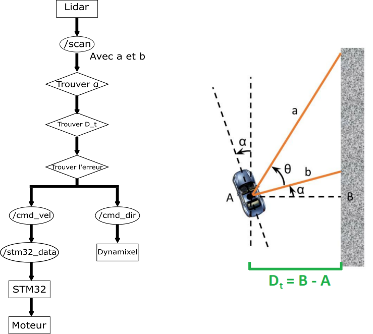

# High Level ROS2
The official Sorbonne University ROS2 repository for the CoVaPsy course at ENS Paris-Saclay. High-Level packages only
**When cloning this repository, please put it in the src folder of you workspace**

### General informations
- Raspberry Pi 5 (RPi5) - OS : Ubuntu 24.04
- ROS2 Jazzy
- Repository for [Low-Level nodes](https://github.com/SU-Bolides/course_ros2)
- [Official repository of the race (for schematics)](https://github.com/ajuton-ens/CourseVoituresAutonomesSaclay.git)
- [Repository of last year (2024)](https://github.com/SU-Bolides/course_2025_slam_pkgs.git) : There is the main branch in ROS and the ROS2 branch
- Repository for the [3D camera](https://github.com/SU-Bolides/3D_cam-RB5) and every code related to the use of RB5 and 3d camera.

### High-Level packages
#### Wall Follower
This package is a simple PID controller to keep the car at a given distance from a wall. The controller is based on the controller created for the F1 Tenth course project at the University of Pennsylvania, you can find the lessons [here](https://f1tenth-coursekit.readthedocs.io/en/latest/lectures/ModuleB/lecture04.html) and the code [here](https://github.com/CL2-UWaterloo/f1tenth_ws/tree/main/src/wall_follow).

We use our Lidar to get two distances at certain angles:
- b need to be at 90° or -90° of the car like in the graph.
- a need to be around [50: 70] or [-50: -70] degrees
- $\theta$ is the angle between the two distances (b-a)

With the distances and $\theta$, we can find $\alpha$ with :
\[\alpha=\arctan{\left(\frac{a\cos{(\theta)}-b}{a\sin{(\theta)}}\right)}\]

Now with this angle, we can easily find the distance $D_t$ between A and B:
\[D_t=b\cos{(\alpha)}\]

This $D_t$ is the actual distance of the car from the wall. We want the car to be at a constant distance $D$ of the wall (e.g 1m), we calcul the error by $\epsilon=D-D_t$. This error will be transform into a steering angle by applying to it a PID controller.
TODO - add clear explanation of the method

For now this controller is not perfect for various reasons :
- Our gain controller (Kp, Kd and Ki) aren't correctly set, so obviously the car doesn't have a good feedback. The use of the simulation would be helpful for us to configure them correctly
- We saw that our car, get some delay in the process, especially when accelerating. This create some obvious problems for a race. We need to check some things to find the reasons :
  - Is our distance calculate by the measure with our Lidar is correct ? Again the simulation can be helpful.
  - Is there a problem between the frequency of data sent between nodes ? At first sight, we weren't able to find a problem here, our cmd_vel_node and cmd_dir_node receive data almost immediatly after getting the data of the Lidar. We could maybe see if it is possible to augment the frequency of the Lidar ?

### Potential field navigator
This package contains a navigation algorithm following the method of potential fields. It is currently the best working reactive algorithm we have (better than the wall follower). Use this one and the unified version in particular for better results. Go and read the README of this package to have more information.

### Troubleshooting
If you ever encounter these problems try these solutions :
- If the car doesn't go forward even if commands are published on /cmd_vel  
&rarr; Press the magic button (the bottom right bottom right next to the little screen saying Sorbonne Bolide)
&rarr; If the car is not moving but is making a beeeeeeep constantly don't worry it just for whatever reason switched forward and backward. If it happens recalibrate the ESC (explanation how to on the low_level repository README) and it should work again as normal.

- If you have problems with the LIDAR/Dynamixel(U2D2)  
&rarr; Try unplug and replug them while shutting off the car. The Dynamixel cable is the 3 cables on the alimentation card right next to the X_AX12 text (bottom right on the top of the green part).

- If you want to check and verify the PWM signal sent by the STM32  
&rarr; Use an oscilloscope and a breadboard to visualize the D9 pin on the STM32. You should see 1000-2000us impulsions. You can find the electric schemes on the Covapsy github.
